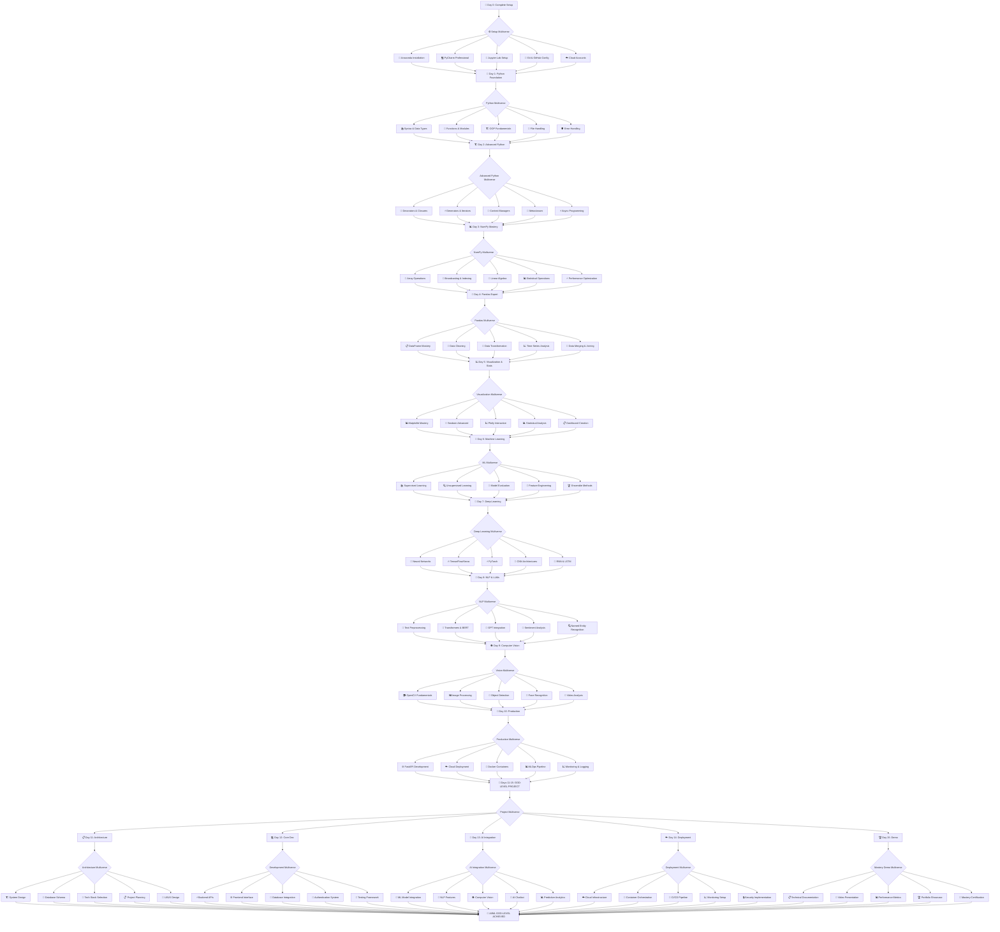

# 🚀 Python AI/ML God-Level Mastery 2025
### 15-Day Complete Transformation Challenge

---

## 🌌 15-Day Multiversal Timeline



---

## 📚 Complete Learning Index

| Day | Topic | Focus Areas | Deliverables |
|-----|-------|-------------|--------------|
| **0** | 🔧 **Complete Setup** | Environment, Tools, Configuration | Working Development Environment |
| **1** | 🐍 **Python Foundation** | Syntax, Data Types, Functions, OOP | 3 Mini Projects |
| **2** | 🏗️ **Advanced Python** | Decorators, Generators, Async, Modules | Advanced Code Patterns |
| **3** | 📊 **NumPy Mastery** | Arrays, Broadcasting, Linear Algebra | Data Processing Pipeline |
| **4** | 🐼 **Pandas Expert** | DataFrames, Analysis, Manipulation | Data Analysis Dashboard |
| **5** | 📈 **Visualization & Stats** | Matplotlib, Seaborn, Statistics | Interactive Visualizations |
| **6** | 🤖 **Machine Learning** | Scikit-learn, Algorithms, Evaluation | ML Model Collection |
| **7** | 🧠 **Deep Learning** | TensorFlow, PyTorch, Neural Networks | Neural Network Implementation |
| **8** | 💬 **NLP & LLMs** | Text Processing, Transformers, BERT | NLP Application |
| **9** | 👁️ **Computer Vision** | OpenCV, Image Processing, CNNs | Vision System |
| **10** | 🚀 **Production Deployment** | APIs, Cloud, MLOps, Monitoring | Deployed ML System |
| **11** | 📋 **Project Design** | Architecture, Planning, Tech Stack | Complete Project Plan |
| **12** | 💻 **Core Development** | Backend, Frontend, Database | Working Application |
| **13** | 🔧 **Advanced Features** | ML Integration, AI Features | Advanced Functionality |
| **14** | ☁️ **Deployment & Testing** | Cloud Deploy, Testing, Optimization | Live Production System |
| **15** | 🏆 **Mastery Demo** | Presentation, Documentation, Portfolio | Professional Showcase |

---

## 🛠️ Complete Setup Requirements

### 💻 **Hardware Requirements**

| Component | Minimum | Recommended | God-Level |
|-----------|---------|-------------|-----------|
| **CPU** | Intel i5 8th gen / AMD Ryzen 5 | Intel i7 10th gen / AMD Ryzen 7 | Intel i9 / AMD Ryzen 9 |
| **RAM** | 16GB DDR4 | 32GB DDR4 | 64GB DDR4+ |
| **Storage** | 512GB SSD | 1TB NVMe SSD | 2TB NVMe SSD |
| **GPU** | Integrated | GTX 1660 Ti / RTX 3060 | RTX 4070+ / RTX 4090 |
| **Internet** | 25 Mbps | 100 Mbps | 500+ Mbps |
| **Display** | 1080p Single | 1440p Dual Monitor | 4K Triple Monitor |

### 🔧 **Software Stack**

#### 🐍 **Core Python Environment**
```bash
Essential Software Installation Order:
├── 1️⃣ Anaconda 2024.06+ (Python 3.11+)
├── 2️⃣ PyCharm Professional 2024.1+
├── 3️⃣ Jupyter Lab 4.0+
├── 4️⃣ Git 2.45+ & GitHub Desktop
├── 5️⃣ Docker Desktop 4.30+
├── 6️⃣ Visual Studio Code (Backup IDE)
└── 7️⃣ Postman (API Testing)
```

#### 📦 **Python Libraries Installation**
```python
# Data Science Stack
conda install pandas numpy matplotlib seaborn scipy scikit-learn

# Deep Learning
conda install tensorflow pytorch torchvision torchaudio

# NLP & Computer Vision
pip install transformers opencv-python pillow spacy nltk

# Web Development & APIs
pip install fastapi uvicorn streamlit flask django

# Database & Cloud
pip install sqlalchemy psycopg2 pymongo boto3 azure-storage

# Jupyter & Productivity
conda install jupyterlab notebook ipywidgets plotly

# Development Tools
pip install black flake8 pytest mypy pre-commit

# Specialized Libraries
pip install langchain openai anthropic gradio chainlit
```

#### ☁️ **Cloud & External Services**
```
Required Accounts & Setup:
├── 🔹 GitHub Account (Free) - Version Control
├── 🔹 Google Colab (Free) - Cloud Computing
├── 🔹 Hugging Face (Free) - Model Hub
├── 🔹 OpenAI API ($5-20) - GPT Access
├── 🔹 AWS Free Tier - Cloud Deployment
├── 🔹 Heroku/Railway (Free) - App Hosting
└── 🔹 Kaggle Account (Free) - Datasets
```

---

## 📋 **Day 0: Complete Environment Setup**

### 🔧 **Step-by-Step Installation Guide**

#### 1️⃣ **Anaconda Installation**
```bash
# Download from: https://www.anaconda.com/download
# Windows: Download .exe installer
# Install with "Add to PATH" checked
# Verify installation
conda --version
python --version
```

#### 2️⃣ **PyCharm Professional Setup**
```
Download: https://www.jetbrains.com/pycharm/
- Use Student License (Free with .edu email)
- Or 30-day trial
- Configure Python Interpreter to Anaconda
- Install Plugins: Jupyter, Database Tools, Docker
```

#### 3️⃣ **Jupyter Lab Configuration**
```bash
# Install Jupyter Lab
conda install -c conda-forge jupyterlab

# Install extensions
jupyter labextension install @jupyter-widgets/jupyterlab-manager
jupyter labextension install plotlywidget

# Start Jupyter Lab
jupyter lab
```

#### 4️⃣ **Git & GitHub Setup**
```bash
# Install Git: https://git-scm.com/
# Configure Git
git config --global user.name "h0s0r"
git config --global user.email "your-email@example.com"

# Clone your repository
git clone https://github.com/h0s0r/Python_AIML_Mastery_2025.git
cd Python_AIML_Mastery_2025
```

#### 5️⃣ **Virtual Environment Setup**
```bash
# Create dedicated environment
conda create -n aiml_mastery python=3.11
conda activate aiml_mastery

# Install all required packages
conda install pandas numpy matplotlib seaborn scipy scikit-learn
conda install tensorflow pytorch torchvision
pip install -r requirements.txt
```

---

## 🎯 **Learning Expectations & Goals**

### 📊 **Skill Progression Matrix**

| Skill Domain | Day 0 | Day 5 | Day 10 | Day 15 | Mastery Level |
|--------------|-------|-------|--------|--------|---------------|
| **Python Programming** | 0% | 60% | 80% | 95% | 🏆 Expert |
| **Data Science** | 0% | 40% | 75% | 90% | 🏆 Expert |
| **Machine Learning** | 0% | 20% | 60% | 85% | 🥇 Advanced |
| **Deep Learning** | 0% | 10% | 45% | 80% | 🥇 Advanced |
| **NLP & Computer Vision** | 0% | 5% | 35% | 75% | 🥈 Proficient |
| **Production Deployment** | 0% | 5% | 25% | 70% | 🥈 Proficient |

### 🎯 **Daily Time Commitment**

```
📅 Daily Schedule (8-10 hours/day):
├── 🌅 Morning (3 hours): Theory & Concepts
├── 🌞 Afternoon (3 hours): Hands-on Coding
├── 🌆 Evening (2-3 hours): Projects & Practice
└── 🌙 Night (1 hour): Review & Planning

📊 Weekly Breakdown:
├── 70% Coding & Implementation
├── 20% Theory & Concepts
├── 8% Project Work
└── 2% Documentation & Review
```

### 🏆 **Success Metrics**

#### ✅ **Daily Success Criteria**
- [ ] Complete all assigned topics
- [ ] Build functional code examples
- [ ] Pass daily skill assessment
- [ ] Commit code to GitHub repository
- [ ] Document learning progress

#### 🎯 **Weekly Milestones**
```
Week 1 (Days 1-7): Python & ML Foundation
├── ✅ Master Python fundamentals
├── ✅ Build data processing pipelines
├── ✅ Create ML models from scratch
└── ✅ Implement neural networks

Week 2 (Days 8-14): Advanced AI & Production
├── ✅ Deploy NLP applications
├── ✅ Build computer vision systems
├── ✅ Create production-ready APIs
└── ✅ Launch cloud-based solutions

Week 3 (Day 15): God-Level Project Demo
├── ✅ Professional project presentation
├── ✅ Complete technical documentation
├── ✅ Industry-ready portfolio
└── ✅ AI/ML mastery certification
```

---

## 🚀 **Final Project: AI-Powered Business Solution**

### 🏗️ **Project Architecture Overview**

```
🎯 Project: "IntelliAssist" - AI Business Intelligence Platform
├── 📊 Frontend: React.js Dashboard
├── 🔧 Backend: FastAPI + Python
├── 🧠 AI Engine: Custom ML/NLP Models
├── 💾 Database: PostgreSQL + Vector DB
├── ☁️ Deployment: AWS/GCP Cloud
└── 📱 Mobile: React Native App
```

### 🎯 **Project Features**
- **📈 Data Analytics Dashboard**
- **🤖 Intelligent Chatbot (GPT Integration)**
- **📊 Predictive Analytics Engine**
- **👁️ Computer Vision Document Processing**
- **💬 NLP Sentiment Analysis**
- **🔄 Real-time Data Processing**
- **🔐 Authentication & Security**
- **📱 Mobile Application**

---

## 📋 **Pre-Challenge Checklist**

### ✅ **Environment Setup Verification**
- [ ] Anaconda installed and configured
- [ ] PyCharm Professional activated
- [ ] Jupyter Lab running successfully
- [ ] Git repository cloned and accessible
- [ ] All Python libraries installed
- [ ] GPU drivers installed (if applicable)
- [ ] Cloud accounts created and configured
- [ ] Development tools tested and working

### 🎯 **Mindset & Preparation**
- [ ] 15-day schedule blocked and protected
- [ ] Distraction-free workspace setup
- [ ] Learning materials organized
- [ ] Support system informed
- [ ] Emergency backup plans ready
- [ ] Motivation and commitment confirmed

---

## 🌟 **Success Guarantee Framework**

### 📊 **Progress Tracking**
```
Daily Metrics:
├── ⏱️ Study Hours Logged
├── 💻 Lines of Code Written
├── 🧪 Projects Completed
├── 📚 Concepts Mastered
└── 🏆 Assessments Passed

Weekly Analytics:
├── 📈 Skill Progression Charts
├── 🎯 Goal Achievement Rate
├── 💡 Innovation Index
└── 🚀 Project Quality Score
```

### 🏆 **Certification Path**
```
🥉 Bronze: Python & Data Science Foundation (Day 5)
🥈 Silver: Machine Learning Engineer (Day 10)
🥇 Gold: AI/ML Expert Certification (Day 15)
💎 Diamond: God-Level AI Master (Project Demo)
```

---

## 🤝 **Support & Resources**

### 📞 **Getting Help**
- **💬 GitHub Issues**: Technical questions and bugs
- **📧 Direct Contact**: h0s0r@github.com
- **🔗 Documentation**: Repository Wiki
- **🎥 Video Tutorials**: YouTube Channel
- **📚 Resource Library**: Curated learning materials

### 🌟 **Community**
- **👥 Study Group**: Discord Community
- **🏆 Leaderboard**: Progress Competition
- **🤝 Peer Support**: Coding Partners
- **🎯 Accountability**: Daily Check-ins

---

**🚀 Ready to Begin Your 15-Day Transformation?**

> *"The future belongs to those who learn more skills and combine them in creative ways."* - Robert Greene

### 🎯 **Next Steps**
1. **✅ Complete Environment Setup** (Day 0)
2. **📚 Begin Day 1: Python Foundation**
3. **🤝 Join Community Discord**
4. **📝 Start Daily Progress Journal**
5. **🚀 Commit to Excellence**

---

**⭐ Star this repository to track your journey!**  
**🔄 Share your progress with #AIMasterChallenge**  
**💪 Transform your career in just 15 days!**

---

*Repository: h0s0r/Python_AIML_Mastery_2025*  
*Created: 2025-06-18 16:47:36 UTC*  
*Challenge Start Date: [Set your date]*  
*Target Completion: [Your goal date]*

[](https://python.org)
[](https://github.com/h0s0r/Python_AIML_Mastery_2025)
[](https://github.com/h0s0r/Python_AIML_Mastery_2025)
[](https://github.com/h0s0r/Python_AIML_Mastery_2025)